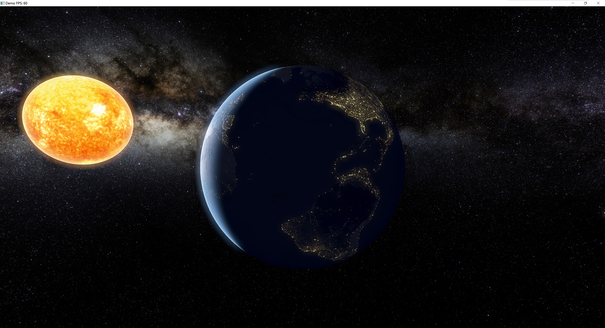

## 日地月模型渲染demo

### 使用

将编译的程序放置于res目录下，或者将res目录路径作为启动参数传入

按**V键**切换视角星球

鼠标旋转视角，滚轮缩放

### 渲染过程

宇宙背景：Cubemap天空盒

太阳：发光材质 + FBM纹理扰动

地球：PBR metallic + 暗面发光 + 太阳光采样（考虑月球遮挡） + 瑞利散射

月球：Lambert + Normal map

后处理：Bloom + HDR Tone mapping

### 截图

